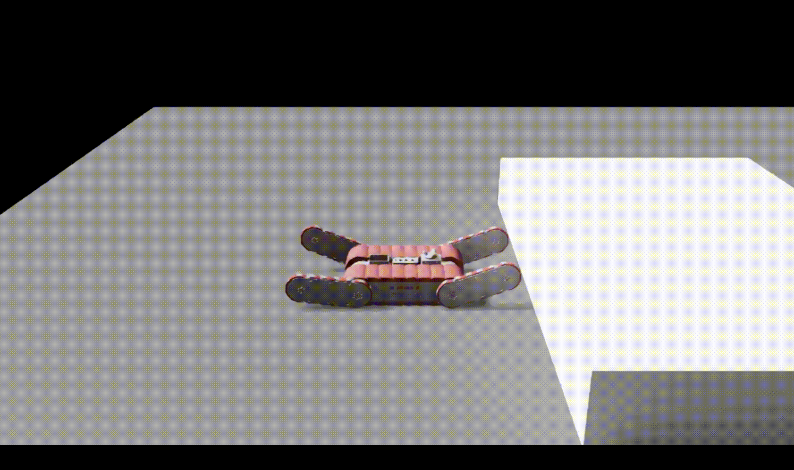

```
  ______ _______ _____        ____                  _     
 |  ____|__   __|  __ \      |  _ \                | |    
 | |__     | |  | |__) |_____| |_) | ___ _ __   ___| |__  
 |  __|    | |  |  _  /______|  _ < / _ \ '_ \ / __| '_ \ 
 | |       | |  | | \ \      | |_) |  __/ | | | (__| | | |
 |_|       |_|  |_|  \_\     |____/ \___|_| |_|\___|_| |_| 
```

# Introduce

This project uses the NuBot rescue robot as the platform and obstacles crossing as the task. It builds a reinforcement learning training system in Isaac Sim and implements commonly used reinforcement learning algorithms.




The core objective of FTR-Bench is to establish a learning framework that enables the articulated tracked robot to navigate obstacles in various terrains. Specifically, FTR-Bench consists of three primary components: the simulation, tasks, and learning algorithms.


The flipper tracked robots have the capability to learn in various terrains. Considering real-world rescue robot applications, we have created four types of terrains, including flat ground, obstacles, bollards, and stairs. The task defines the conditions and objectives that the tracked robots need to meet in each scenario.

Eventually, our experiments demonstrate that RL can facilitate the robots to achieve some remarkable performance on such challenging tasks, enabling the agent to learn the optimal obstacle-navigation strategies within the environment. And there is still some room for improvement and more difficult tasks for future work.

## Tasks Design
| Task Name | Description | Demo     |
|  :----:  | :----:  | :----:  |
|Drive on Flat Terrain| Simulate the tracked robot traversing on flat terrain, with the successful completion of the task defined when the tracked robot reaches the specified position. |     |
| Cross the Bar| Simulate the tracked robot crossing a long strip of terrain, with the successful completion of the task defined when the robot reaches the other side of the strip. |     |
|Cross the Steps| Simulate the tracked robot ascending or descending a step higher than its own height, with the successful completion of the task defined when it reaches the next level of the step. |     |
|Drive on Plum Pile| Simulate the tracked robot navigating on uneven terrain, with the successful completion of the task defined when the robot traverses through a set of obstacles, such as flower pots. |     |
|Drive on Wave Terrain| Simulate the tracked robot navigating through uneven and asymmetric terrain, with the successful completion of the task defined when the robot traverses the asymmetric area. |     |
|Up the Stairs| Simulate the tracked robot climbing stairs, with the successful completion of the task defined when the robot reaches the top of the stairs. |     |
|Down the Stairs| Simulate the tracked robot descending stairs, with the successful completion of the task defined when the robot reaches the ground. |     |
|Mixed Terrain| Simulate the tracked robot navigating through various complex terrains, with the successful completion of the task defined when the robot reaches the specified endpoint. |     |
|Front Swing Arm Only| Simulate a scenario where one-directional articulation of the arm is disabled, and the obstacle traversal task is accomplished using only the arms in a single direction. |     |


# Install

## Isaac Sim
The simulation platform used in this project is Isaac Sim. The installation address of the official website is as follows

[download and install Isaac Sim](https://docs.omniverse.nvidia.com/app_isaacsim/app_isaacsim/install_workstation.html)

## Python
After Isaac Sim is installed successfully, there is a file named **python.sh** in its installation directory. This is a python that comes with Isaac Sim. First, you need to configure the built-in Python environment of Isaac Sim. Here, name this python **isaac-python**. If you are using bash, then add the following code to the last line of **.bashrc**

```shell
alias 'isaac-python=~/.local/share/ov/pkg/isaac_sim-*/python.sh'
```
## Install dependencies

```shell
isaac-python -m pip install -r scripts/requirements.txt
```
Related dependencies github
* [rl-games](https://github.com/Denys88/rl_games)
* [omniisaacgymenvs](https://github.com/NVIDIA-Omniverse/OmniIsaacGymEnvs)

# Train

To start training, you can execute the following code

~~~shell
isaac-python scripts/benchmark.py train sac steps 40
~~~

If you want to test the training results, you can use the following command

~~~shell
isaac-python scripts/benchmark.py play
~~~

# Supported RL algorithms are listed below:

- [Proximal Policy Optimization (PPO)](https://arxiv.org/pdf/1707.06347.pdf)
- [Trust Region Policy Optimization (TRPO)](https://arxiv.org/pdf/1502.05477.pdf)
- [Twin Delayed DDPG (TD3)](https://arxiv.org/pdf/1802.09477.pdf)
- [Soft Actor-Critic (SAC)](https://arxiv.org/pdf/1812.05905.pdf)
- [Deep Deterministic Policy Gradient (DDPG)](https://arxiv.org/pdf/1509.02971.pdf)
- [Dueling Double DQN (D3QN)](https://arxiv.org/pdf/1812.05905.pdf)

# Enviroment Performance
<table>
    <tr>
        <th colspan="2"> Drive on Flat Terrain</th>
        <th colspan="2">Cross the Bar</th>
    <tr>
    <tr>
        <td></td>
        <td></td>
        <td></td>
        <td></td>
    <tr>
    <tr>
        <th colspan="2"> Cross the Steps</th>
        <th colspan="2">Drive on Plum Pile </th>
    <tr>
    <tr>
        <td></td>
        <td></td>
        <td></td>
        <td></td>
    <tr>
    <tr>
        <th colspan="2"> Drive on Wave Terrain</th>
        <th colspan="2">Up the Stairs </th>
    <tr>
    <tr>
        <td></td>
        <td></td>
        <td></td>
        <td></td>
    <tr>
    <tr>
        <th colspan="2"> Down the Stairs</th>
        <th colspan="2">Mixed Terrain </th>
    <tr>
    <tr>
        <td></td>
        <td></td>
        <td></td>
        <td></td>
    <tr>
    
</table>

# Research papers published using FTR-Bench

<details open>
<summary>(Click to Collapse)</summary>

- Research paper
  - [Geometry-Based Flipper Motion Planning for Articulated Tracked Robots Traversing Rough Terrain in Real-time](https://onlinelibrary.wiley.com/doi/abs/10.1002/rob.22236): Journal of Field Robotics, 2023,  https://doi.org/10.1002/rob.22236.
  - [Deep Reinforcement Learning for Flipper Control of Tracked Robots](https://arxiv.org/abs/2306.10352): ArXiv 2023, https://doi.org/10.48550/arXiv.2306.10352.
<details close>


